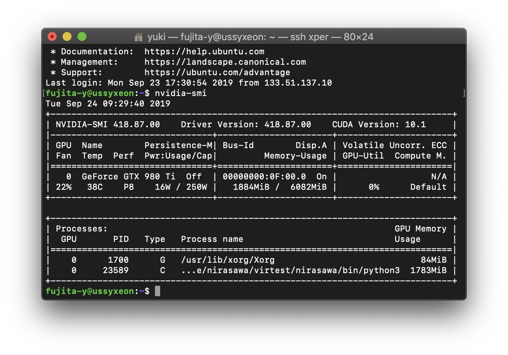

This is a project done with [XperLab](https://www.xpercept.aclab.esys.tsukuba.ac.jp/) from Tsukuba University.


# Deep learning emotion recognition with Japanese audio.

## Contributions

- A large dataset of short speech videos of Japanese personel. These were collected from YouTube.

- Emotion recognition on Japanese audio

##

## Too Short; Want More?

[Here](/TSWM/TSWM.ipynb) is a detailed notebook (日本語) of the techniques used.

## Dependencies

(In Progress)

## 研究室向け

### dlib
dlibはは既にインストールされているので`pip install dlib`ではインストールせずに、以下を実行してください。


```
export PYTHONPATH="/usr/local/lib/python3.5/dist-packages/dlib-19.17.99-py3.5-linux-x86_64.egg:$PYTHONPATH"
```

### CUDA
Cudaも既にダウンロードされています。ただしパスが色々設定されていないので、以下を実行してください。

```
export CUDA_PATH=/usr/local/cuda
export PATH=$CUDA_PATH/bin:$PATH
export LD_LIBRARY_PATH=$CUDA_PATH/lib64:$LD_LIBRARY_PATH
export CPATH=$CUDA_PATH/include:$CPATH
export LIBRARY_PATH=$CUDA_PATH/lib64:$LD_LIBRARY_PATH
export LD_LIBRARY_PATH=$CUDA_PATH/lib64:$LD_LIBRARY_PATH
```

### Cupy
CUDAのバージョンに該当するCupyをダウンロードする必要があります。
`nvidia-smi`でバージョンを確認してから、[Cupy Documentation](https://docs-cupy.chainer.org/en/stable/install.html#install-cupy)を参考に該当するバージョンをpipで入れてください。


僕が研究していたときはCUDA10.1だったので`pip install cupy-cuda101`で大丈夫でした。
